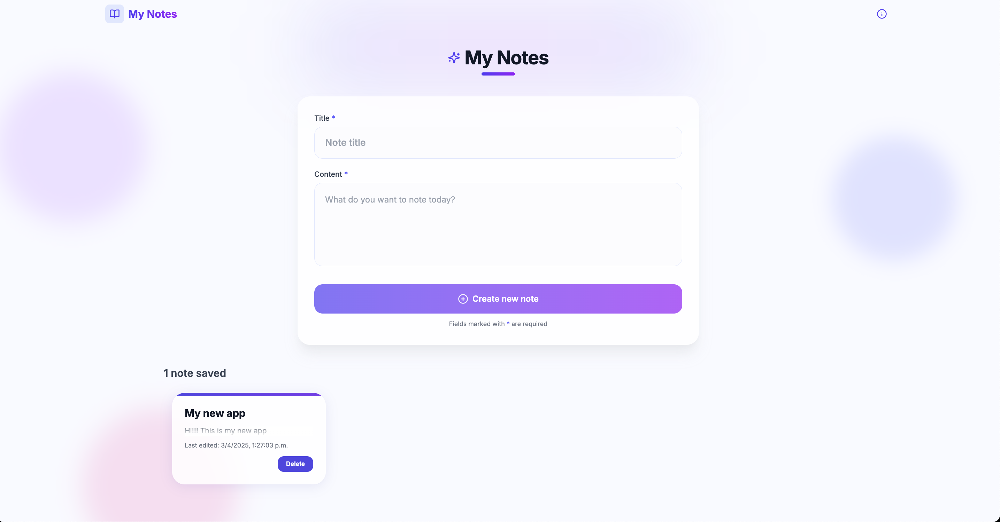

# My Notes 📝



A modern, elegant, and fast note-taking web app built with **Next.js 15**, **TypeScript**, **Tailwind CSS**, **SQLite**, and **Lit Web Components**.  
Designed for quick note management with a clean and animated UI.

---

## 🚀 Features

- ✅ Server-side rendering using **Next.js App Router**
- ✅ **React + Lit** interoperability (custom Web Component for each note)
- ✅ Animated note interactions with **Framer Motion**
- ✅ Responsive grid layout with **Tailwind CSS**
- ✅ Create, edit, delete notes
- ✅ Notes stored in a local **SQLite** database (via `better-sqlite3`)
- ✅ Styled with custom gradients and glassmorphism

---

## 🧱 Tech Stack

- **Next.js 15 (App Router)**
- **React 18**
- **TypeScript**
- **Tailwind CSS**
- **Framer Motion**
- **Lucide Icons**
- **SQLite** (via `better-sqlite3`)
- **Lit** for Web Components

---

## 📁 Folder Structure (Simplified)

```bash
├── app/ → App Router structure
│ ├── actions/ → Server Actions for fetching/mutating notes
│ │ ├── get-notes.ts → Server-side GET logic
│ │ └── notes.ts → createNote, updateNote, deleteNote
│ ├── api/
│ │ └── notes/ → API Routes (legacy or optional)
│ │ ├── route.ts → GET, POST
│ │ └── [id]/route.ts→ PUT, DELETE
│ ├── layout.tsx → Root layout with header/footer
│ ├── page.tsx → Main homepage (uses SSR)
│ └── globals.css → Global Tailwind + custom styles
│
├── components/ → React components
│ ├── AppHeader.tsx → App top navbar
│ ├── NoteForm.tsx → Note creation/editing form
│ ├── NoteList.tsx → Animated list of notes (grid)
│ ├── NoteItem.tsx → Wrapper for each note card (Web Component)
│ └── NoteManager.tsx → Handles note logic and state
│
├── web-components/ → Lit Web Components
│ └── note-card.ts → <note-card> component for each note
│
├── db/ → Local SQLite setup
│ └── index.ts → Initializes and exposes db connection
│
├── public/ → Static assets (if any)
│
├── types/ → TypeScript types
│ └── utils.ts → Note type definition
│
├── README.md
├── package.json
├── tsconfig.json
└── next.config.js
```

---

## 🛠️ Getting Started

### 1. Clone the repository

```bash
git clone git@github.com:your-username/My-Notes.git
cd My-Notes
```

### 2. Install dependencies

```bash
npm install
```

### 3. Run the development server

```bash
npm run dev
```

Open http://localhost:3000 in your browser.

## 💾 Database Setup (SQLite)

This app uses a local SQLite database.

By default, the database file will be created automatically at:

```bash
/db/sqlite.db
```

If it doesn't exist, the schema will be initialized automatically using better-sqlite3.

## 🧪 Useful Scripts

```bash
npm run dev      # Start the dev server
npm run build    # Build for production
npm run start    # Start the production server
```

## 🙌 Credits

Created with ❤️ using Next.js, React, and Lit.
Designed with modern UI/UX in mind and deployed as a clean, minimal notes app.
